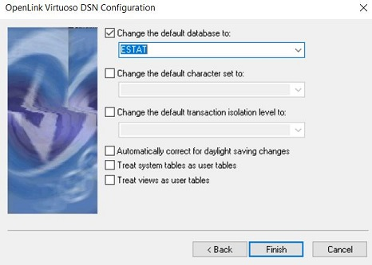

# Setup the Content Database

You will find in the Script SQL folder various file that help build the content database. You can go to the Database/Interactive SQL tab.

## 1. Setup the structure

If it is your first instantiation, please use the [global script cdb_global_v2.sql](
./CDB%20content/Script%20SQL/cdb_global_v2.sql)

If you are updating an existing database the needed scripts can be find in each specific folder.

## 2. Static data
Some tables have to be filled in order for the project to work, such as:
- Named entities
-	Modality

## 3. Statistics Explained Data
Like before, if it is your first instantiation of the database, please use the global script :  [global script cdb_global_v2.sql](
./CDB%20content/Script%20SQL/cdb_global_v2.sql)
If it is an update, the scripts needed can be find in the [Statistics Explained folder](./CDB%20content/Script%20SQL/Statistics Explained/). Launch the scripts in the following order : 

-	[cdb_link_info_v1.sql](./CDB%20content/Script%20SQL/Statistics Explained/cdb_link_info_v1.sql)
-	[cdb_glossary_v2.sql](./CDB%20content/Script%20SQL/Statistics Explained/cdb_glossary_v2.sql)
-	[cdb_articles_v1.sql](./CDB%20content/Script%20SQL/Statistics Explained/cdb_articles_v1.sql)
-	[estat_new_exp_stat.sql](./CDB%20content/Script%20SQL/Statistics Explained/estat_new_exp_stat.sql)

## 3. Load Statistics Explained Data

For Statistics Explained data for the first instantiation of the database,  please use the [global SE script](Content%20Database/CDB%20content/Script%20SQL/Statistics%20Explained/cdb_global_se_data_v1.sql).

Error 

## 4. Create ODBC connection to the Virtuoso server on Windows

* Open the ODBC Data Sources (64-bit) tool in control panel, go to Tab System DSN and create a new data source selecting the Virtuoso (Open Source) driver. Press Finish to start the configuration.

 
* Fill the first configuration screen as follows. Do NOT put http:// or https:// in front of the server address.

* In the next screen, fill-in your user name and password (the default is user:dba, password:dba) and press Next:

* A connection should be established. Change the default database to ESTAT and press Finish.

* Restart your system. You should be able to connect to the database using pyodbc. In the call to connect() replace "user name" and "password" with your credentials, all within the connection string.

 

Once the database is set you can start launching the [article spiders](Content%20Database/CDB%20content/Scrapper/README.md)

## 5. Load Eurostat glossary data
In order to gather the glossary instead of scrapping the data we used the bulkdownload option and created SQL queries from it.

First the [modality queries](Content%20Database/CDB%20content/Script%20SQL/Estat13k/estat13k_modalities_data.sql) have to be launch. 
??????? do we need this and where in Virtuoso Interactive SQl query

Then the [glossary data](Content%20Database/CDB%20content/Script%20SQL/Estat13k/estat13k_glossary_data.sql), in order to do it use the following [Jupyter Notebook](Content%20Database/CDB%20content/Script%20SQL/cdb_insert.ipynb) or the [python code](Content%20Database/CDB%20content/Script%20SQL/cdb_insert.py)

Finally, you can add the last queries : [estat13k_stat_and_measurement_unit_data](Content%20Database/CDB%20content/Script%20SQL/Estat13k/estat13k_stat_and_measurement_unit_data.sql)

??????? do we need this and where in Virtuoso Interactive SQl query

# to be continue...

????????If you are updating an existing database the needed scripts can be find in the  

?????????If it is an update, the scripts needed can be find in the 

Once the database is set you can start launching the various 

##### 4.2.2 Eurostat glossary
In order to gather the glossary instead of scrapping the data we used the bulkdownload option and created SQL queries from it.

First the  have to be launch.

Then the , in order to do it use the following Jupiter Notebook : 

Finally, you can add the last queries : 

##### 4.2.3 Dictionnary and Datasets
As previously, we did not scrap the following datas, we first downloaded the raw and created SQL queries in order to fill the database.

The first step is to fill the  and then using  launch each . 

At these stage, the dictionnary and code are all in the content database, however we found that we have to add somme code to the time dictionnary in order for our work on the datasets to work. You'll find the added elemnts 

Then you can add some  and then using  launch each  to add the links between the datasets and the dictionnaries. 
