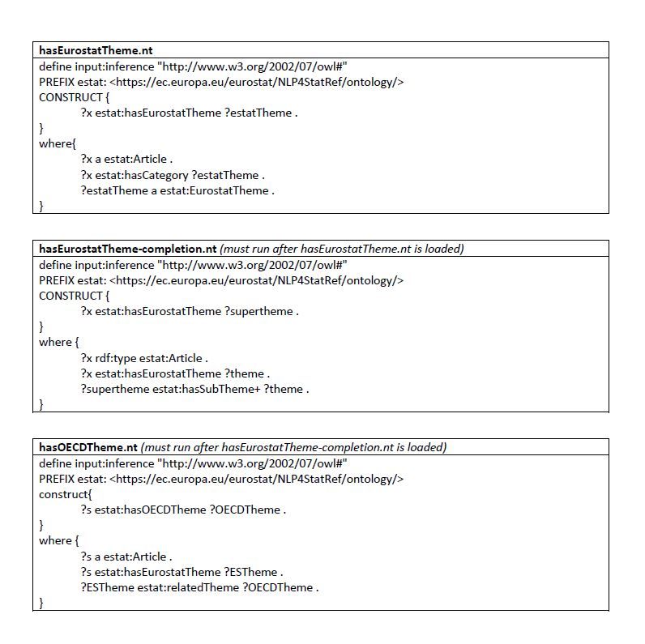

  

This directory contains the latest documentation of the knowledge database in  **KD\_Documentation_v2.3.docx**. This document includes the description of the ontologies and the alignment with external Linked Open Data (LOD) vocabularies.

It also contains all the files related to the Eurostat ontology and the Eurostat Knowledge Graph (or Knowledge DataBase - KDB). Specifically:


-    Folder “ontology”:  
     - **estat.owl**: This is the main Eurostat ontology file (in OWL), that contains the definitions of the main classes and properties. It imports **estat-alignments.owl** and **estat-Database.owl**. This file was knowledge engineered manually.   
     - **estat-alignments.owl**: This file (in OWL) contains the alignments between the classes and properties of the Eurostat ontology and several popular external ontologies, such as DC, DCMI, DCAT, SKOS, Schema.org, etc. It is imported by **estat.owl**. This file was knowledge engineered manually.    
     - **estat-Database.owl**: This file (in OWL) contains the ontology hierarchy beneath class estat:StatisticalData that represents the navigation tree of Eurostat’s Database. It contains both classes and instances. It is imported by **estat.owl**. This file is automatically constructed by executing the **EuroStatDataset.py** and **EurostatDatasetGround.py** codes.  
-    Folder “knowledge graph”:  
     - **GlossaryExplainedArticles.ttl**, **GlossaryLink.ttl**, **OECD.ttl**, **TermTopicNamedRelation.ttl**: 
     - These files (in Turtle syntax, namely a syntax for RDF graphs), contain all the instances ,their property values and relationships for all the classes of the Eurostat ontology (**estat.owl**). 
     - These files are automatically constructed by executing the codes in [https://github.com/eurostat/NLP4Stat/tree/main/Knowledge%20Database/KD_Population](https://github.com/eurostat/NLP4Stat/tree/main/Knowledge%20Database/KD_Population) **Eurostat\_Populate\_Glossary\_Explained\_Articles.ipynb**, **Eurostat\_Populate\_Glossary\_LinkInfo.ipynb**, **Eurostat\_Populate\_OECD.ipynb**, and **Eurostat\_Populate\_Term\_Topic_Type.ipynb**, respectively.  
-    Folder “knowledge graph/derivations”:
     - contains the files **hasEurostatTheme.nt**, **hasEurostatTheme-completion.nt**, **hasOECDTheme.nt**, in N-Triples format (another syntax variation for RDF graphs) that enrich the knowledge graph with derivations through the following three SPARQL CONSTRUCT queries, respectively, that link articles to Eurostat and OECD themes:
```
define input:inference "http://www.w3.org/2002/07/owl#" 
PREFIX estat: <https://ec.europa.eu/eurostat/NLP4StatRef/ontology/>
CONSTRUCT {
	?x estat:hasEurostatTheme ?estatTheme .
}
where{
	?x a estat:Article .
	?x estat:hasCategory ?estatTheme .
	?estatTheme a estat:EurostatTheme .
}

```


### Note:

The following OWL files are the same with the ones mentioned above. They are kept here for reasons of compatibility with earlier descriptions, but **they not include the imports** mentioned above. For example, they will **not** be loaded correctly in Protégé. Specifically:

- **NLP4StatRef-Ontology-v2.3.owl** is the same as **estat.owl**.
- **NLP4StatRef-Ontology-datasets-v2.3.owl** is the same as **estat-Database.owl**.  
- **NLP4StatRef-Ontology-alignment-v2.3.owl** is the same as **estat-alignments.owl**
 
