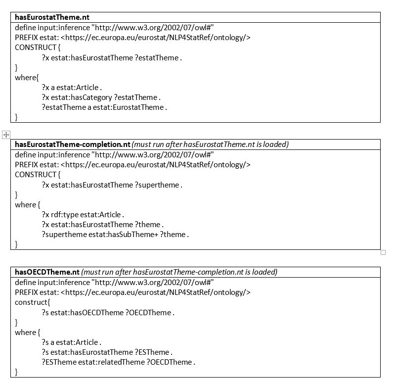

This folder contains:
*    The new ontology of the knowledge database in an OWL file: NLP4StatRef-Ontology-v2.3.owl
*    Another ontology which contains the hierarchy of the datasets in Eurostat's database: NLP4StatRef-Ontology-datasets-v2.3.owl  
*    The alignments between the classes and properties of the Eurostat ontology and several external ontologies: NLP4StatRef-Ontology-alignment-v2.3.owl
*    The latest documentation of the knowledge database: KD_Documentation_v2.3.docx. It includes the description of the two ontologies and the alignment with external Linked Open Data (LOD) vocabularies.

## New description (in progress)  

This directory contains all the files related to the Eurostat ontology and the Eurostat Knowledge Graph (or Knowledge DataBase - KDB). Specifically:
*    Folder “ontology”:  
    * estat.owl: This is the main Eurostat ontology file (in OWL), that contains the definitions of the main classes and properties. It imports estat-alignments.owl and estat-Database.owl. This file was knowledge engineered manually.   
    -    estat-alignments.owl: This file (in OWL) contains the alignments between the classes and properties of the Eurostat ontology and several popular external ontologies, such as DC, DCMI, DCAT, SKOS, Schema.org, etc. It is imported by estat.owl. This file was knowledge engineered manually.    
    -    estat-Database.owl: This file (in OWL) contains the ontology hierarchy beneath class estat:StatisticalData that represents the navigation tree of Eurostat’s Database. It contains both classes and instances. It is imported by estat.owl. This file is automatically constructed by executing the EuroStatDataset.py and EurostatDatasetGround.py codes.  
*    Folder “knowledge graph”:  
    -    GlossaryExplainedArticles.ttl, GlossaryLink.ttl, OECD.ttl, TermTopicNamedRelation.ttl: These files (in Turtle syntax, namely a syntax for RDF graphs), contain all the instances ,their property values and relationships for all the classes of the Eurostat ontology (estat.owl). These files are automatically constructed by executing the Eurostat_Populate_Glossary_Explained_Articles.ipynb, Eurostat_Populate_Glossary_LinkInfo.ipynb, Eurostat_Populate_OECD.ipynb, and Eurostat_Populate_Term_Topic_Type.ipynb codes, respectively.  
    -    Folder “derivations”: contains the files hasEurostatTheme.nt, hasEurostatTheme-completion.nt, hasOECDTheme.nt, in N-Triples format (another syntax variation for RDF graphs) that enrich the knowledge graph with derivations through the following 3 SPARQL CONSTRUCT queries, respectively, that link articles to Eurostat and OECD themes:

