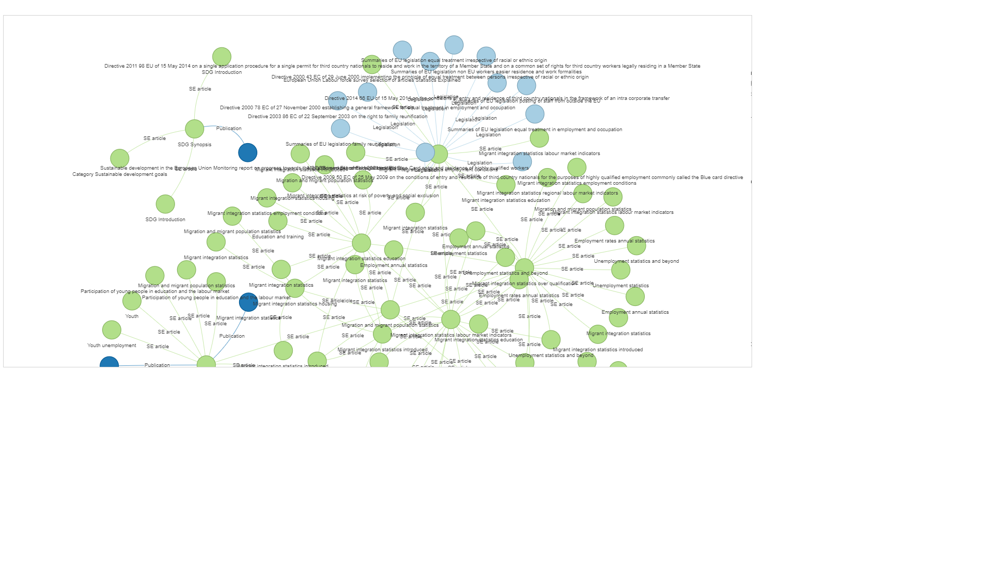
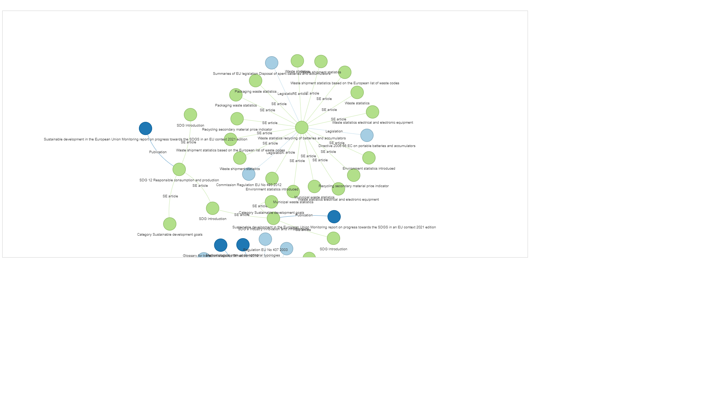

# Knowledge graph visualization

- [Knowledge_graph_2022_05_16.ipynb](https://github.com/eurostat/NLP4Stat/blob/testing/Knowledge%20Database/Knowledge_graph/Knowledge_graph_2022_05_16.ipynb) : this is a **updated version in a Google Colab notebook** working with the **new knowledge database**. Please see instructions at the top of the notebook.

The steps are as follows: 

1.  Connection to the Virtuoso database. 

2.  Extraction of relationships: The start nodes are all SE articles which contain the keywords in at least one paragraph. These articles can refer to other SE articles, SE Glossary articles, Data, News articles, Publications, Legislation, etc. These references define the edges and the end nodes. The type of the resource been referenced (related resource) can be found by the pattern in the related URL. Keep only the edges with references to other SE articles, SE Glossary articles, Publications and Legislation, for reasons of clarity in the resulting graph. 

3.  Identify the unique nodes in the graph by finding the unique URIs in the start and end nodes and give them a unique numeric ID. 

4.  Merge the unique node IDs with the main file with the relationships. Also group the edges and end nodes by type (SE article, Data, Publication, Legislation). 

5.  Pass above to the drawing function using different colours for the groups of edges / end nodes.

### Examples: 
#### keywords = migrant integration 

#### keywords = electric vehicle 

#### keywords = morbidity statistics 

