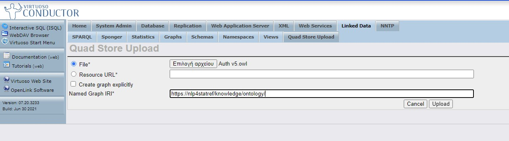

### Revision note (April 2002): The new ontologies and the new KD documentation are in folder [KD model v2](https://github.com/eurostat/NLP4Stat/tree/main/Knowledge%20Database/KD%20model%20v2).

### 1. Knowledge database

#### 1.1. Loading and deleting ontologies

Before populating the KDB, the ontology files must be added to the database. Go to Virtuoso Conductor/Linked Data/Quad Store Upload and load the NLP4Stat files, starting with the .owl files. In the "Named Graph IRI*" field, write https://nlp4statref/knowledge/ontology/. This IRI will be used in the process of populating the KDB.

The prefered order of loading the files is as follows:  

From the https://github.com/eurostat/NLP4Stat/tree/main/Knowledge%20Database/KD%20model%20v2 folder, get the *ontology* and *knowledge graph* subfolders, and then upload the files in the following order:
- A.	Folder “ontology”:
  - A.1.	estat.owl: main Eurostat ontology file.
  - A.2.	estat-alignments.owl: alignment between Eurostat ontology and external ontologies.
  - A.3.	estat-Database.owl: ontology hierarchy beneath class estat:StatisticalData.
- B.	Folder “knowledge graph”: instances of the Eurostat ontology classes
  - B.1.	GlossaryExplainedArticles.ttl
  - B.2.	GlossaryLink.ttl
  - B.3.	OECD.ttl
  - B.4.	TermTopicNamedRelation.ttl
- C.	Folder “knowledge graph/derivations”: derived knowledge graph enrichments 
  - C.1.	hasEurostatTheme.nt
  - C.2.	hasEurostatTheme-completion.nt
  - C.3.	hasOECDTheme.nt

An already added ontology can be deleted by going to Linked Data/Graphs/Graphs and clicking the Delete button associated with the ontology which is going to be deleted. 

#### 1.2. Knowledge database population 

The KD_Population folder contains notebooks and Python scripts used for the populating of the knowledge database. Please see [relevant instructions]( https://github.com/eurostat/NLP4Stat/tree/main/Knowledge%20Database/KD_Population).

#### 1.3. Knowledge database backup 

To take a backup of the whole knowledge graph, go to Conductor / Interactive SQL (ISQL) and paste the code in [backup_script.txt](backup_script.txt), then paste below the command: 

dump_one_graph('https://ec.europa.eu/eurostat/nlp4stat/knowledge/', './data_', 1000000000);  

The backup files are located in folder C:\virtuoso\db in the Virtual Machine of lod.csd.auth.gr (Windows):   
data_000001.ttl.graph and   
data_000001.ttl.gz  

There may be more files, similarly numbered (data_000002., data_000003., ... ) if the database is large.

#### 1.4. Knowledge database restore

Go to Conductor / Linked Data / Quad Store Upload (named graph IRI: https://ec.europa.eu/eurostat/nlp4stat/knowledge/) and upload the files  
data_000001.ttl.gz, data_000002.ttl.gz, data_000003.ttl.gz, …

#### 1.5. Knowledge graph

A knowledge graph can be created using the notebook in the Knowledge_graph folder. Please see [dedicated readme file](https://github.com/eurostat/NLP4Stat/tree/main/Knowledge%20Database/Knowledge_graph). 

### 2. Virtuoso Bundle
In order to launch the various part of the project from a Windows environment, please follow the procedure described in [Software Environment](https://github.com/eurostat/NLP4Stat/tree/main/Software%20Environment).

The Virtuoso database is now set up. The first step is now to fill the content database with scrapped content. Please refer to the [Content Database](https://github.com/eurostat/NLP4Stat/tree/main/Content%20Database) folder.
