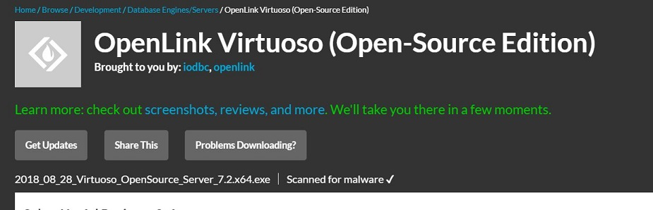
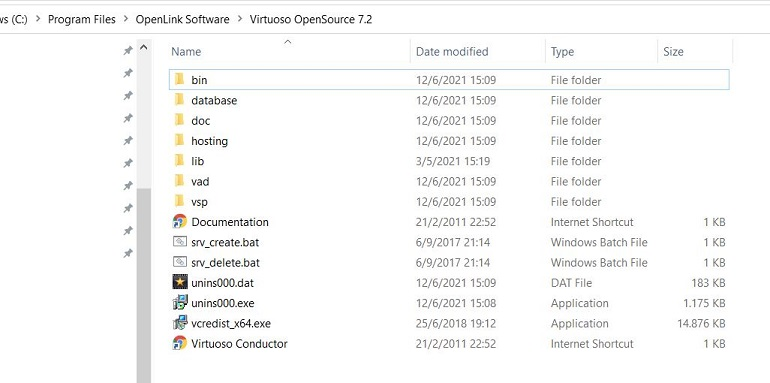
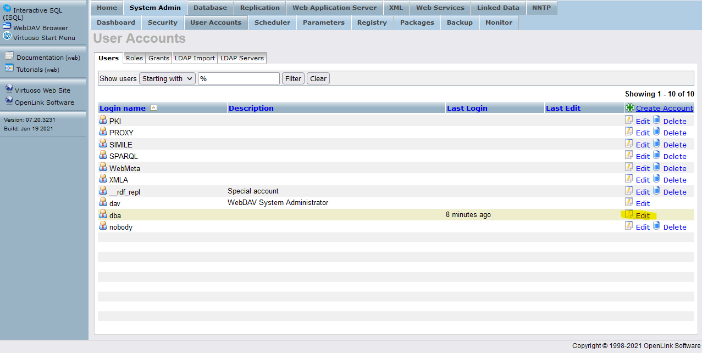
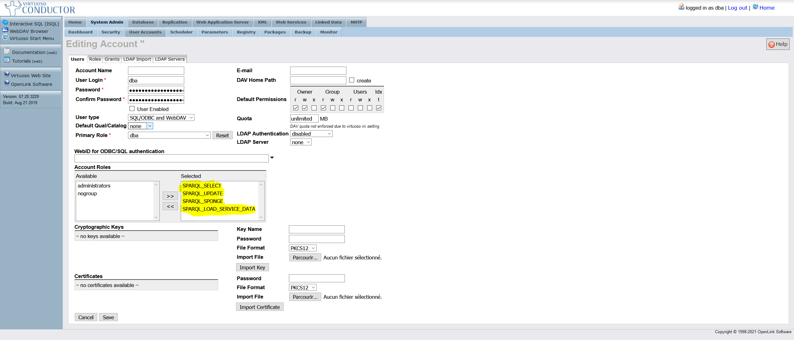
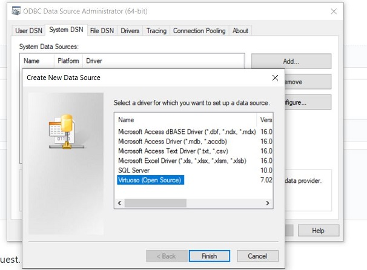
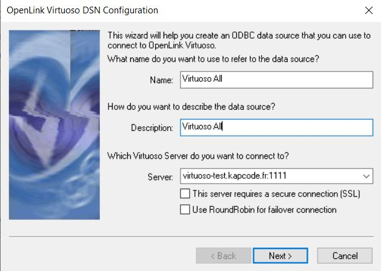
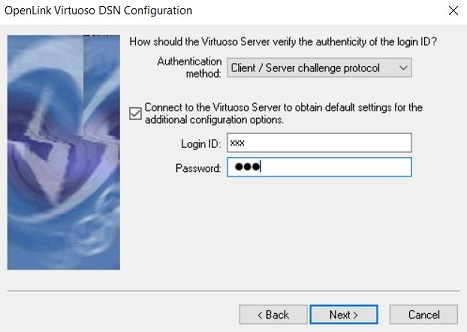
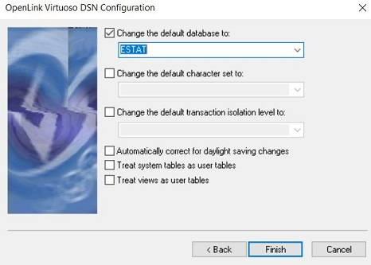
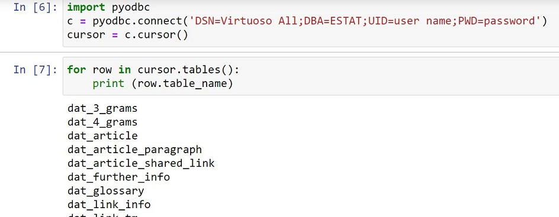

# 1.a Installation of [Virtuoso](https://github.com/openlink/virtuoso-opensource) on a Windows machine

* Download the Virtuoso Open Source (VOS) for Windows distribution. Preferably version 7.2 for 64-bit machines which is available [here](https://github.com/openlink/virtuoso-opensource/releases). 

*  Run the installer as administrator and accept the defaults. The default installation is shown below:

* With this default installation as example:
    *  Go to the **system** environment variables and add C:\Program Files\OpenLink Software\Virtuoso OpenSource 7.2\bin and C:\Program Files\OpenLink Software\Virtuoso OpenSource 7.2\lib to the system PATH variable.
    *  Crete a new **system** variable VIRTUOSO_HOME with value C:\Program Files\OpenLink Software\Virtuoso OpenSource 7.2\

# 1.b Installation of a docker image of Virtuoso

* Create the docker image using the `docker-compose up docker-compose.yml`. The [docker-compose.yml](Docker%20Images/docker-compose.yml) is in the `Docker Images` folder. 

# 2. Conmect to the Virtuoso server
In a browser go to http://localhost:8890 and on the Virtuoso frontend/GUI click on Conductor login using the username `dba` and the password defined in the [docker-compose.yml](Docker%20Images/docker-compose.yml) file (the default password is `dba`).

# 3. Virtuoso user parameters

Go to System Admin/User accounts , to be able to launch SPARQL queries, please edit the user account for the 'dba' user as such :

# 3. Create ODBC connection to the Virtuoso server on Windows

* Open the ODBC Data Sources (64-bit) tool in control panel, go to Tab System DSN and create a new data source selecting the Virtuoso (Open Source) driver. Press Finish to start the configuration.

 
* Fill the first configuration screen as follows. Do NOT put http:// or https:// in front of the server address.

* In the next screen, fill-in your user name and password (the default is user:dba, password:dba) and press Next:

* A connection should be established. Change the default database to ESTAT and press Finish.

* Restart your system. You should be able to connect to the database using pyodbc. In the call to connect() replace "user name" and "password" with your credentials, all within the connection string.

 

##

### 4. Content database

You will find in the Script SQL folder various file that help buil the content database. You can go to the  Datatbase/Interactive SQL tab.

#### 4.1 Structure

If it is your first instantiation, please use the 

If you are updating an existing database the needed scripts can be find in the  

#### 4.2 Static data

Some tables have to be filled in order for the project to work, such as:
- Named entities
- Modality

##### 4.2.1 Statistics Explained Data

Like before, if it is your first instantiation of the database,  please use the  .

If it is an update, the scripts needed can be find in the 

Once the database is set you can start launching the various 

##### 4.2.2 Eurostat glossary
In order to gather the glossary instead of scrapping the data we used the bulkdownload option and created SQL queries from it.

First the  have to be launch.

Then the , in order to do it use the following Jupiter Notebook : 

Finally, you can add the last queries : 

##### 4.2.3 Dictionnary and Datasets
As previously, we did not scrap the following datas, we first downloaded the raw and created SQL queries in order to fill the database.

The first step is to fill the  and then using  launch each . 

At these stage, the dictionnary and code are all in the content database, however we found that we have to add somme code to the time dictionnary in order for our work on the datasets to work. You'll find the added elemnts 

Then you can add some  and then using  launch each  to add the links between the datasets and the dictionnaries. 

### 5. Knowledge database

#### 5.1 Loading and deleting ontologies

Before populating the KDB, the ontology file must be added to the database. Go to Virtuoso Conductor/Linked Data/Quad Store Upload and load the NLP4Stat ontology by uploading the .owl file in https://github.com/eurostat/NLP4Stat/tree/main/KD%20model/. In the "Named Graph IRI*" field, write https://nlp4statref/knowledge/ontology/. This IRI will be used in the process of populating the KDB.
A already added ontology can be deleted by going to Linked Data/Graphs/Graphs and click on Delete button associated to the ontology you wish to delete. 

#### 5.2 Knowledge database population 

The KD_Population folder contains notebooks used for populating the knowledge database with elements stored in the content database, using SPARQL queries. 
A demo notebook is available to select elements contained in the KDB.
The ESTAT_Populate_KDB notebooks contain the addition of all elements that are currently stored and mapped (i.e. relations are modeled).
As the process does not include a verification step of the presence of a triplet before adding it, the notebook should be launched once. Do not hesitate to delete and add anew the ontology before populating it again using the notebook. 

#### 5.3 Knowledge graph

A knowledge graph can be created using the elements of the Knowledge_graph folder. A dedicated readme file is there. 

### 6. Virtuoso Bundle
In order to launch the various part of the project from a Windows environment, please follow the procedure described in [Virtuoso Setup](https://github.com/eurostat/NLP4Stat/blob/main/Virtuoso%20Setup/README.md)

The Virtuoso database is now set up. The first step is now to fill the content database with scrapped content. Please refer to the [Scrapper](Scrapper) folder.
