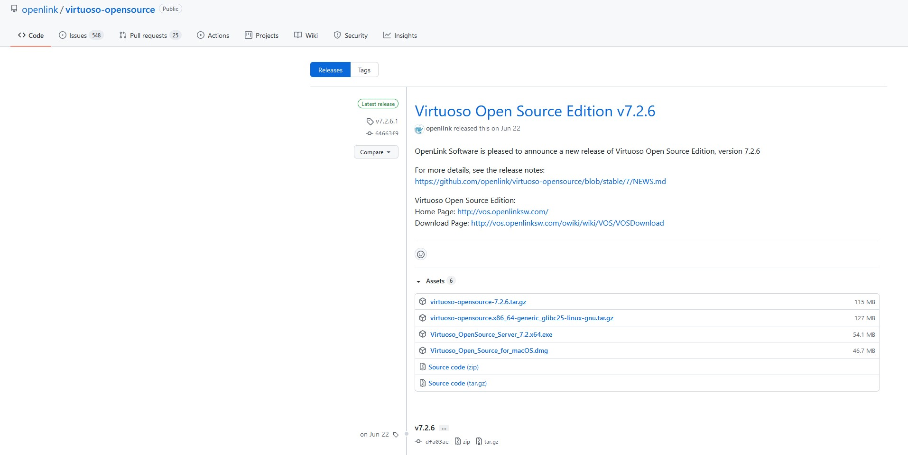
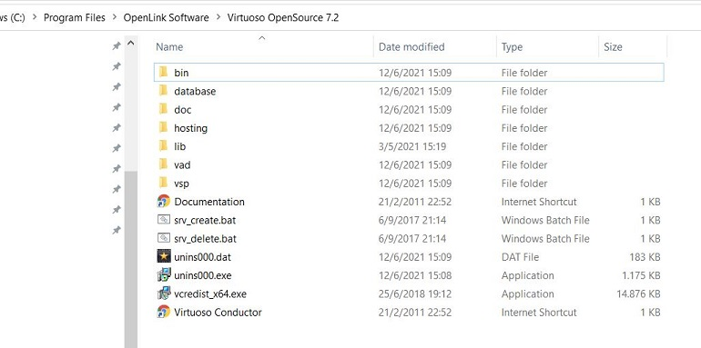
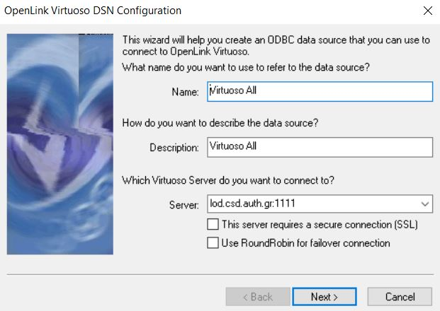
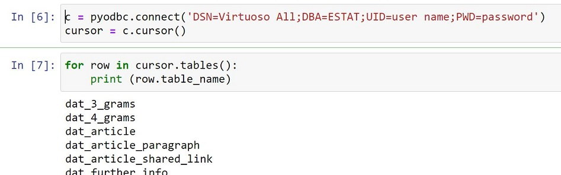
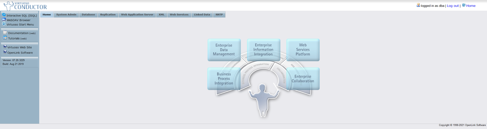
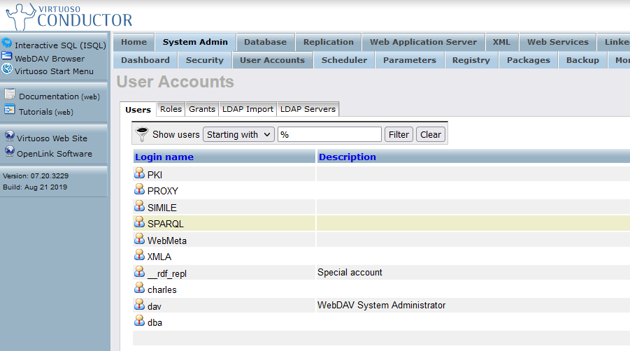
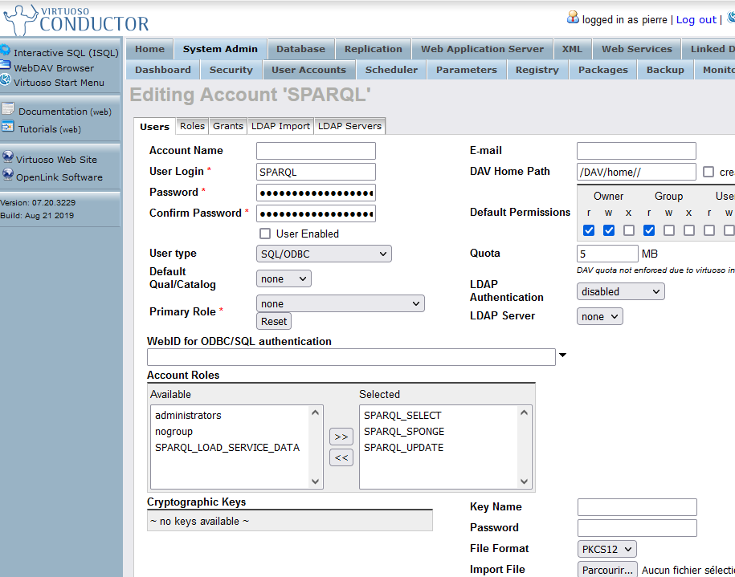

# 1.a Installation of [Virtuoso](https://github.com/openlink/virtuoso-opensource) on a Windows machine

* Download the Virtuoso Open Source (VOS) for Windows distribution. Preferably version 7.2 for 64-bit machines which is available [here](https://github.com/openlink/virtuoso-opensource/releases). 

*  Run the installer as administrator and accept the defaults. The default installation is shown below:

* With this default installation as example:
    *  Go to the **system** environment variables and add C:\Program Files\OpenLink Software\Virtuoso OpenSource 7.2\bin and C:\Program Files\OpenLink Software\Virtuoso OpenSource 7.2\lib to the system PATH variable.
    *  Crete a new **system** variable VIRTUOSO_HOME with value C:\Program Files\OpenLink Software\Virtuoso OpenSource 7.2\

* Open the ODBC Data Sources (64-bit) tool in control panel, go to Tab System DSN and create a new data source selecting the Virtuoso (Open Source) driver. Press Finish to start the configuration.

* Fill the first configuration screen as follows. Do NOT put http:// or https:// in front of the server address.

* In the next screen, fill-in your user name and password and press Next:

* A connection should be established. Change the default database to ESTAT and press Finish.

* Restart your system. You should be able to connect to the database using pyodbc. In the call to connect() replace "user name" and "password" with your credentials, all within the connection string.

# 1.b Installation of a docker image of Virtuoso

* Create the docker image using the `docker-compose up docker-compose.yml`. The [docker-compose.yml](Docker%20Images/docker-compose.yml) is in the `Docker Images` folder. 

# 2. Connect to the Virtuoso server
In a browser go to http://localhost:8890 and on the Virtuoso frontend/GUI click on Conductor login using the username `dba` and the password defined in the [docker-compose.yml](Docker%20Images/docker-compose.yml) file (the default password is `dba`).

# 3. Virtuoso user parameters

Go to System Admin/User accounts , to be able to launch SPARQL queries, please edit the user account for the 'SPARQL' user as such :

Save the changes.

