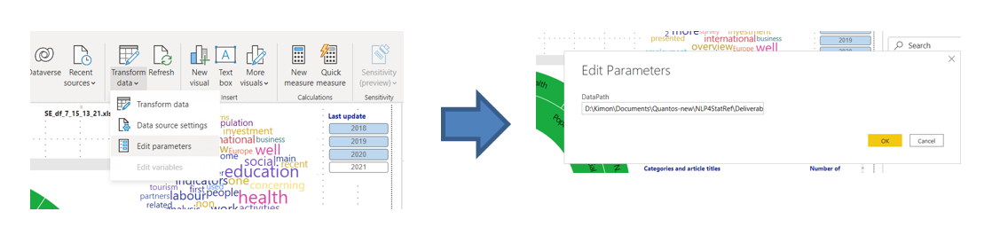
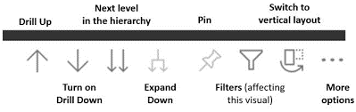
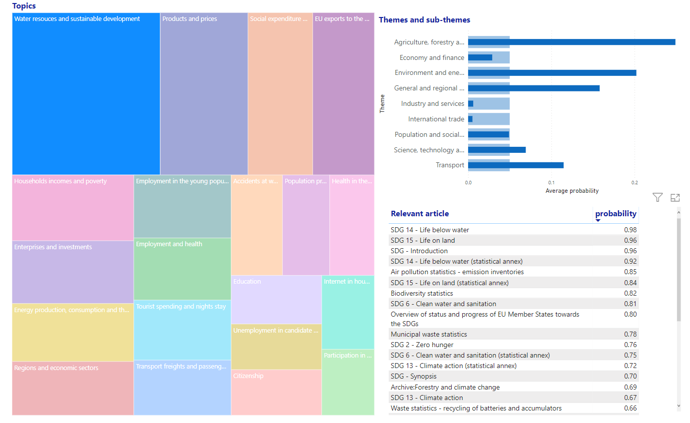

### MS Power BI application

The MS Power BI application works with the free desktop version and is portable. It can also be published to MS Azure cloud, with any Office 365 license. To install the application, it suffices to define the path where the required files are located from the menu Transform data / Edit parameters. In the textbox, please put this path, ending with a backslash (\\). This parameter is called *DataPath*.

Figure 1 -- Setting the data path in the MS Power BI application.  

The required files and the codes producing them are shown in Figure 2 below. They are all included in the GitHub at:

<https://github.com/eurostat/NLP4Stat/tree/main/Use%20Case%20A%20Graphical%20exploration/Power_BI>

-   The main data coming from the database through the Python code *Use Case A prepare data_v2.ipynb*, is exactly the same as the one used in the R Shiny application[^1]. As shown in Figure 2, the application will automatically recognize the latest file required (matching the regex "\^SE_df.\*xlsx\$") in the folder defined by the parameter *DataPath*. At the time of the writing of the current document, this file was named  SE_df_7_15_13_21.xlsx.

-   These data create the internal tables "Original" and "Repeated rows" (see Figure 3). The first comes from the original data while the second is created from the first by splitting themes, sub-themes and categories into unique values (in repeated rows).

-   Another input file concerns the leaf nodes (i.e. datasets) in the Eurostat database tree, starting from the top division into Database by themes, Tables by themes, Cross-cutting topics and Tables for EU policy. It is generated by parsing the xml table of contents from the bulk download facility with the Python notebook *Crumbs.ipynb*. At the time of the writing of the current document the input file was named *Crumbs_7\_14_23_17.xlsx*. This file is also automatically recognized by the application. It results to the internal standalone table "Crumbs".

  

Figure 2 -- Feeding of the MS Power BI application.

-   The last files are direct exports of *tables tm_topics* and *tm_articles_to_topics* from the Virtuoso database. They result to the internal tables with the same names which are connected by *topic_id*. *tm_articles_to_topics* is also connected to the "Repeated rows" table by *article_id*.

Figure 3 -- Tables and relationships in the MS Power BI application.

The application consists of four screens. The **first screen** ("Themes, sub-themes and categories (1)") contains a sunburst plot with the themes, subthemes and categories, in which the sizes are proportional to the number of articles. Selecting any of these, filters the list of articles by category at the bottom right part ot the screen and also updates the word cloud at the top right part. The latter is based on words collected from the abstracts of the articles. There are also information cards at the top left part of the screen and a last update year filter to the right of the word cloud. There are also inverse interactions, i.e. the interactions between the sunbust plot, the word cloud and the categories are all 2-way.

To see the categories together with the individual articles for the current selections, one can click the "expand all down one level" icon in the list of categories and articles.

Figure 4 -- Graphical exploration in MS Power BI: themes, sub-themes, categories and articles (1).

The **second screen** ("Themes, sub-themes and categories (2)") (see Figure 5) also links themes, sub-themes, categories and articles, with the same data as the first screen. The filters in the middle of the screen allow the selection of any number of themes and sub-themes and the network graph in the top right side is adjusted to reflect these selections. Conversely, one can click on a node in the network graph to select a theme or sub-theme.

This screen also shows the distribution of the filtered articles per category in the top left sode, again allowing the inverse interaction, i.e. the selection of one or more (pressing Ctrl) categories. The relevant articles are displayed at the bottom left part of the screen and there is also a pie chart showing the distribution into years of last update (again, allowing inverse interaction, i.e. further filtering by selected years).

Figure 5 -- Graphical exploration in MS Power BI: themes, sub-themes, categories and articles (2).

The **third screen** ("DB topics and datasets") (see Figure 7) is based on the standalone table "Crumbs", mentioned earlier. It contains a treemap with the structure of Eurostat's database at the top three levels. The records correspond to leaf nodes only. As with every visual created from hierarchical data, the user can select a segment or navigate to the next level in the hierarchy (double down arrow) or expand all levels (see "Expand down" in the icons below). The right part has a list with the corresponding datasets and their download links (in zipped TSV format). Clicking on a link downloads the selected dataset.

Figure 6 -- Icons for navigation in hierarchical data in MS Power BI.

Figure 7 -- Graphical exploration in MS Power BI: DB topics and datasets.

The fourth screen ("Topic modelling" - Figure 8) is produced from the data with the topic modeling results. Recall that these data include the distribution of articles into topics, that is, the probabilities of each article belonging to a topic (which sum up to one for each article).

The main visual in this screen is a treemap with the 20 topics. When a user selects a topic, the list in the lower right side displays the articles which have a probability ≥ 0.5 of appearing in this topic, in descending order of probability. Strictly speaking, we use as measure in the list, the sum of probabilities, so that when all topics are selected, all articles are displayed with probability one. When one topic is selected, these sums are the actual probabilities. An example is shown in Figure 7 with the topic "Water resources and sustainable development" and the display of relevant articles. On the other hand, the size of the topics in the treemap is proportional to the average probability. This average probability is also used in the bar chart in the top right side, which dislays the themes and sub-themes in a hierarchical way. Selection of a topic makes this bar chart show the closeness of the topic with the themes or sub-themes. Conversely, one can select a theme or sub-theme and get an idea of the distribution into topics, together with the most relevant articles.

Figure 8 -- Graphical exploration in MS Power BI: Topic modeling.

[^1]: See: <https://github.com/eurostat/NLP4Stat/blob/main/Use%20Case%20A%20Graphical%20exploration/R%20Shiny%20files/R%20Shiny%20application.md>
