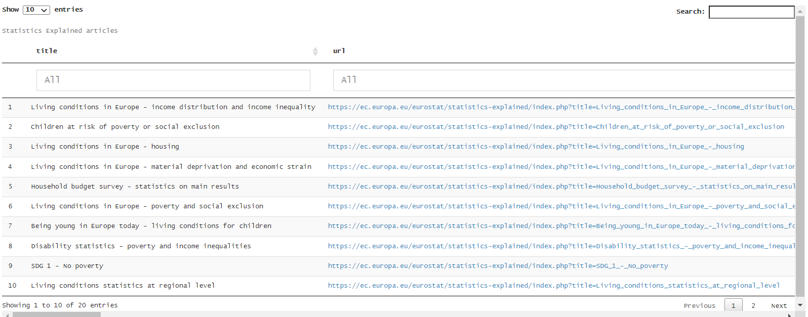

### R Shiny application

The is a simple interactive R Shiny application which displays a dynamic sunburst plot allowing the user to navigate on themes, sub-themes and available categories below sub-themes and displaying the relevant SE articles. An example is shown in Figure 1 and Figure 2 which follow. 

The user selects the theme "Population and social conditions" and the plot drills-down to this theme. He/she then can proceed by selecting sub-theme "Living conditions". At each step, clicking at the center of the plot allows back-steping to the previous (more general) selection. The current selection is also shown in an infobox at the top of the screen.

Figure 1 -- Graphical exploration in R Shiny: navigation with the interactive\
sunburst plot (1).

Figure 2 -- Graphical exploration in R Shiny: navigation with the interactive\
sunburst plot (2).

The next figure shows the display of 20 articles under the theme "Population and social conditions", sub-theme "Living conditions", category "Poverty and social exclusion".

Figure 3 -- Graphical exploration in R Shiny: navigation with the interactive\
sunburst plot: display of articles under a specific theme, sub-theme and category.

Each column in the results (title, url, year, abstract) has a filter allowing further drill-down, with highlighting of the matched terms. An example is shown in Figure 4 with “SDG” in the URLs of the previous results.

Figure 4 – Graphical exploration in R Shiny: Drill-down with highlighting in the results.

The application also includes some filters in the side bar, for the selection of a particular year as the year of last update, for the filtering by keyword in the article titles and for the filtering by keyword in the article abstracts.

The input to the application is the data with the SE articles information, produced by a Python notebook currently named *Use Case A prepare data_v2.ipynb*, which is actually the one used in the Faceted search[^1], except for a very small change. This small change is shown below in the lines in bold.

...

`SE_df['themes'] = SE_df['themes'].apply(lambda x: ';'.join(x))`  

`SE_df['sub_themes'] = SE_df['sub_themes'].apply(lambda x: ';'.join(x))`  

**`## de-comment to produce the input file for R Shiny and Power BI,`** 

**`## i.e. categories not in list but separated by semicolon`**  

**`## SE_df['categories']= SE_df['categories'].apply(lambda x: ';'.join(x))`** 

 `print(SE_df.isnull().sum(),'\n')`

`print('No info in themes: ',sum(SE_df['themes']==''))`

`print('No info in sub_themes: ',sum(SE_df['sub_themes']==''))`

...

The GitHub link at [https://github.com/eurostat/NLP4Stat/tree/‌main/Use%20Case%20A%20Graphical%20exploration/R%20Shiny%20files](https://github.com/eurostat/NLP4Stat/tree/main/Use%20Case%20A%20Graphical%20exploration/R%20Shiny%20files) contains a recent output of this code (at the time of the writing of the current document, named *SE_df_7\_15_13_21.xlsx*).

For the running of the R Shiny code from withing RStudio, it **suffices to have the necessary libraries installed (see end of this document), place the app.R file together with the Excel file in any folder and run the app**. The app will automatically select **the most recent Excel file matching the regex pattern \'\^SE_df.\*xlsx\$**

The following diagram in Figure 5 shows the feeding of the application and the interactions. The production of the input file through *Use Case A prepare data_v2.ipynb* also shows the offline file which is used to import the categories. This is produced by the scraping codes.

Figure 5 -- Graphical exploration in R Shiny: feeding data and interactions.

The following is part of the sessionInfo() output, showing the environment used for the development, including the R version and the versions of the libraries loaded:
 * R version 4.0.2 (2020-06-22)
 * Platform: x86_64-w64-mingw32/x64 (64-bit)
 * Running under: Windows 10 x64 (build 19042)
 * other attached packages:
     * stringi_1.5.3 
     * data.table_1.13.0
     * openxlsx_4.1.5       
     * plotly_4.9.2.1
     * ggplot2_3.3.3
     * DT_0.14              
     * shinycssloaders_1.0.0
     * shinydashboard_0.7.1
     * shiny_1.5.0    

[^1]: see <https://github.com/eurostat/NLP4Stat/tree/main/Use%20Case%20A%20Faceted%20search>
