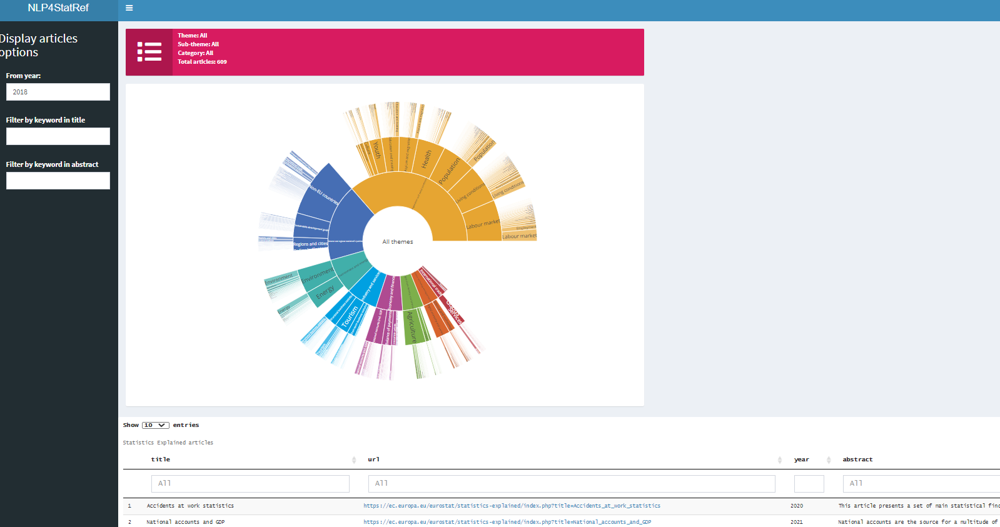
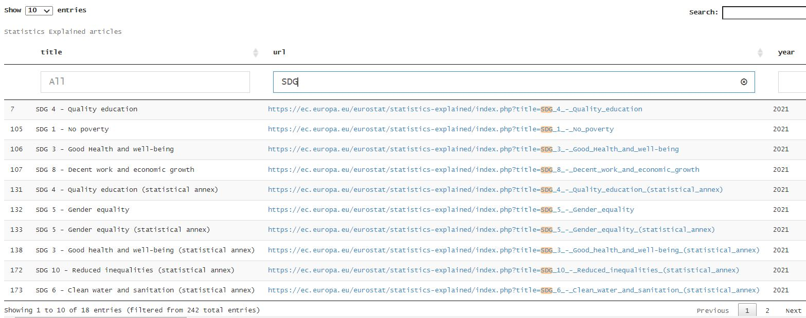
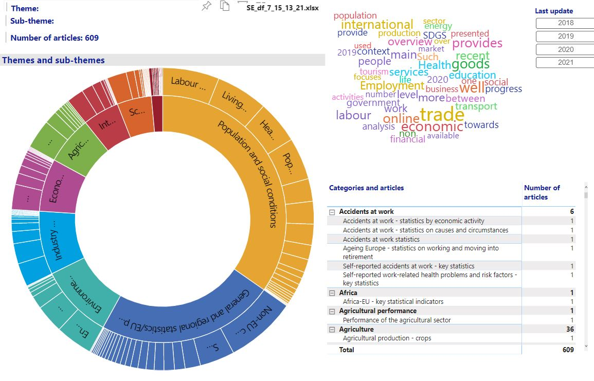
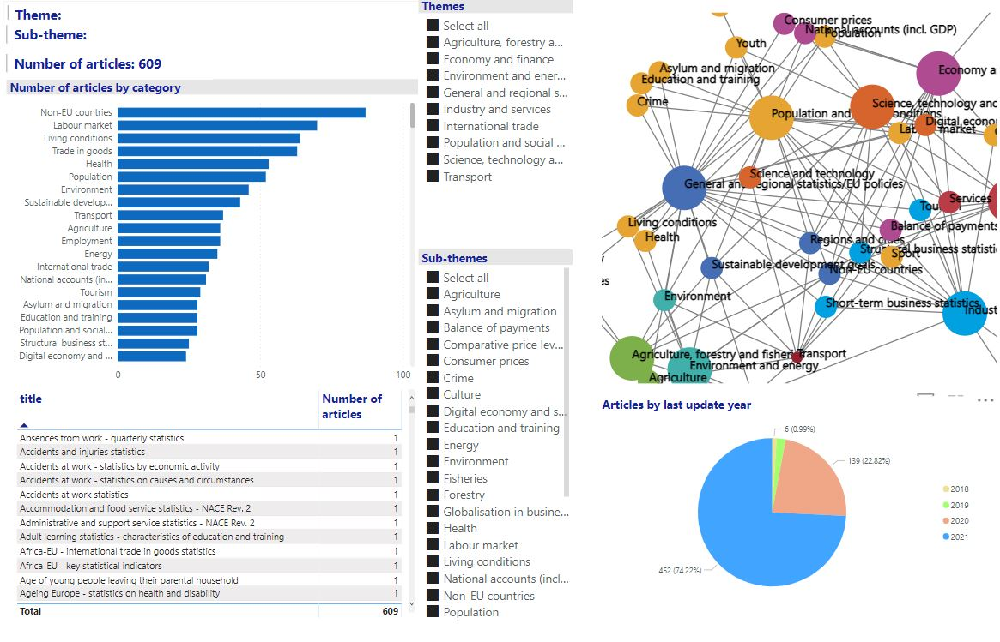
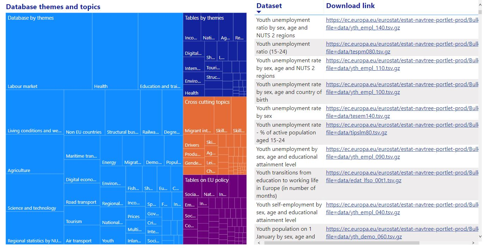
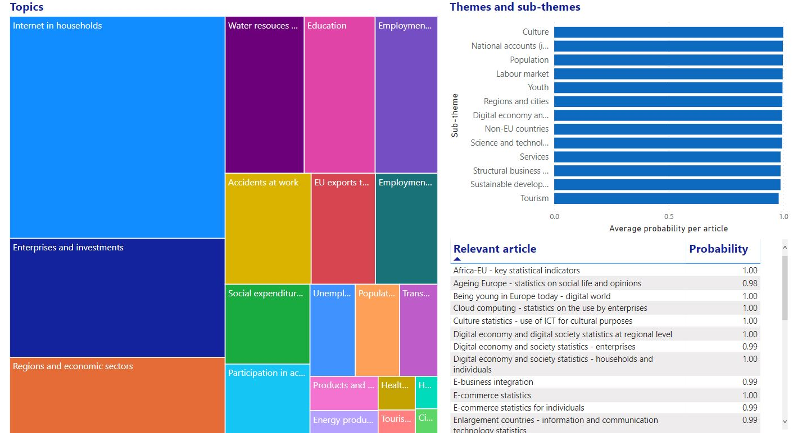

### Use Case A - Graphical exploration. 

* The **first code** is an R Shiny application allowing the navigation in themes, sub-themes and categories and the display of corresponding articles. There are also some filters for the display of articles, for the year of last update and for keywords in titles and abstracts. Each column in the results (title, URL, year, abstract) has a filter allowing further drill-down, with highlighting of the matched terms. 
* The source code (app.R) is in folder [Shiny files](https://github.com/eurostat/NLP4Stat/tree/main/Use%20case%20A/Use%20Case%20A%20Graphical%20exploration/R%20Shiny%20files). A **short documentation** is given [here](https://github.com/eurostat/NLP4Stat/blob/main/Use%20case%20A/Use%20Case%20A%20Graphical%20exploration/R%20Shiny%20files/R%20Shiny%20application.md).
* The same folder contains the Python code for the connection with the database and the production of the input file (Use Case A prepare data_v2_rev_Jan2022.ipynb), together with a recently produced file (SE_df_7_15_13_21.xlsx). 
* To run the code producing the input file, please replace user_name and password  with your credentials in command:  
c = pyodbc.connect('DSN=Virtuoso All;DBA=ESTAT;UID=user_name;PWD=password'). See also installation instructions in this notebook.
* The current functionalities can be seen in the **online version** [here](https://quantos-stat.shinyapps.io/Graphical_exploration_v2/). Because of frequent changes, please press **Reload** in your browser if you have visited this link already.

* The **second** code is an MS Power BI report allowing again the navigation in themes, sub-themes and categories and the display of corresponding articles. There is also an interactive wordcloud graphical element and a network element connecting themes with sub-themes. Another page displays the database structure in a treemap, together with the dataset names and download links for the selected section. A fourth page links the topic modeling results with themes, sub-themes, categories and articles.
* A **short documentation** is given [here](https://github.com/eurostat/NLP4Stat/blob/main/Use%20case%20A/Use%20Case%20A%20Graphical%20exploration/Power_BI/MS%20Power%20BI%20application.md). The following data requirements are explained in the documentation but also mentioned here:
* The current .pbix file is in folder [Power BI](https://github.com/eurostat/NLP4Stat/tree/main/Use%20case%20A/Use%20Case%20A%20Graphical%20exploration/Power_BI). The same folder contains:
    * The Python code for the connection with the database and the production of the input files (Use Case A prepare data_v2_rev_Jan2022.ipynb), together with two recently produced files (SE_df_2_1_12_43.xlsx and Crumbs_2_1_12_44.xlsx). 
    * This code also produces, in Excel files, two direct exports from the topic modelling results with the SE articles currently in the content database:
        * Table ESTAT.V1.tm_topics into tm_topics.xlsx - a look-up table for the topics, their keywords and their descriptions.
        * Table ESTAT.V1.tm_articles_to_topics into tm_articles_to_topics.xlsx - this contains the associated distributions of articles into topics). 
* To run the Python code producing the input file from the database (Use Case A prepare data_v2_rev_Jan2022.ipynb), please replace user_name and password  with your credentials in command:  
c = pyodbc.connect('DSN=Virtuoso All;DBA=ESTAT;UID=user_name;PWD=password'). See also installation instructions in this notebook.
* The current functionalities can be seen in the **online** version [here](https://app.powerbi.com/view?r=eyJrIjoiMzczMTNlZTUtYTI2OC00Yzc3LThiNTUtYmE5NjNmMTM4ZmUwIiwidCI6ImM1MmVlYWMzLWUwNzctNDMyYy04MWUzLTRiY2JhZjZiOTM1ZSIsImMiOjl9&pageName=ReportSection0134a3f3c4be88106abb). Because of frequent changes, please press **Reload** in your browser if you have visited this link already.

