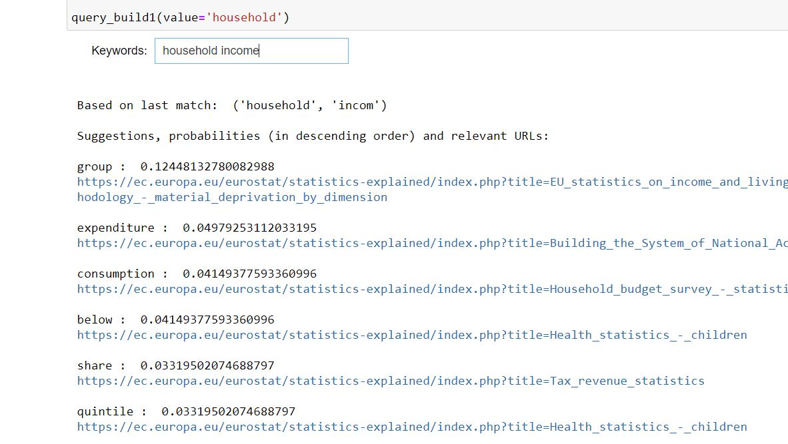

Use Case A - Query builder. 

* File [Query_Builder_Senario_A_v6b_both_GL_SE.ipynb](Query_Builder_Senario_A_v6b_both_GL_SE.ipynb): The code receives inputs directly from the database. It accepts content from **both SE articles and SE Glossary articles, with result to very rich 'suggestions'**. The speed is mostly affected by the quality of the connection to the Virtuoso database. Please replace your user name and password in the command  
c = pyodbc.connect('DSN=Virtuoso All; DBA=ESTAT; UID=user_name; PWD=password'). 

* [GC_Query_Builder_Senario_A_v6b_both_GL_SE.ipynb](GC_Query_Builder_Senario_A_v6b_both_GL_SE.ipynb) is a Google Colab version.

* [GC_Query_Builder_Use_Case_A_v7_rev_June2022.ipynb](GC_Query_Builder_Use_Case_A_v7_rev_June2022.ipynb) is also a Google Colab notebook, demonstrating the reading of all data from the Knowledge Database with SPARQL queries. The performance improvement is significant.

