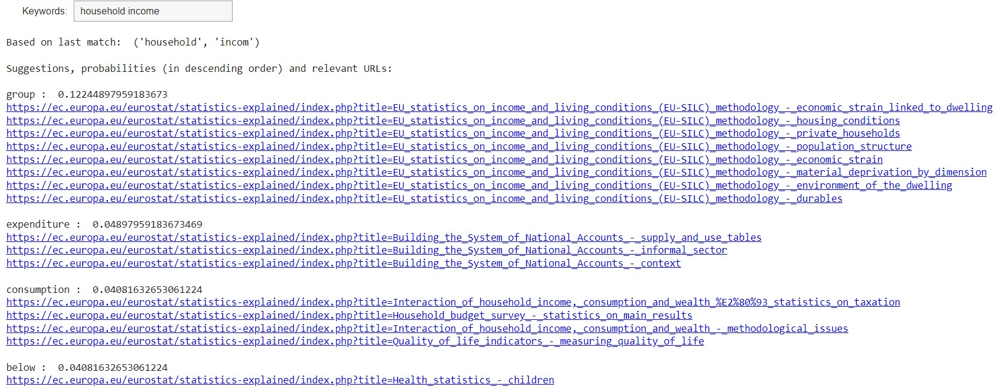

Use Case A - Query builder. 

* File [GC_Query_Builder_Use_Case_A_v7_rev_June2022.ipynb](GC_Query_Builder_Use_Case_A_v7_rev_June2022.ipynb): The code is a Google Colab notebook and receives inputs directly from the Knowledge Database with SPARQL queries. It accepts content from **both SE articles and SE Glossary articles, with result to very rich 'suggestions'**. The code also demonstrates the significant performance improvement over SQL queries in the Content Database (execution time drops to around 25%). Launch the notebook and put your own credentials in the chunk with title "Connect to the Virtuoso database".

