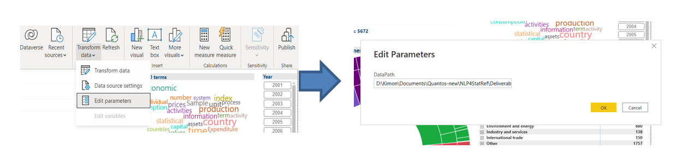

### MS Power BI application

### In progress: The content below is from Use Case A - to be adjusted

The MS Power BI application works with the free desktop version and is portable. It can also be published to MS Azure cloud, with any Office 365 license. To install the application, it suffices to define the path where the required files are located from the menu Transform data / Edit parameters. In the textbox, please put this path, ending with a backslash (\\). This parameter is called *DataPath*.

Figure 1 -- Setting the data path in the MS Power BI application.  

The required files and the codes producing them are shown in Figure 2 below. They are all included in the current folder.

-    The main data are in two Excel files: OECD_content_for_PowerBI.xlsx  and SE_df_for_PowerBI.xlsx . These are produced by the Python code PowerBI_inputs_v1.ipynb . 
-    This last notebook requires a) the same file with the scraped content from OECD's Glossary of Statistical Terms (OECD_final_results_2.xlsx) which is used in the Query Builder and the Faceted Search, and b) file themes_eurostat_oecd_v2.xlsx, used also in the Faceted Search, which was created manually and contains, for each Eurostat theme and subtheme, the related OECD’s themes. 
-    These data create the internal tables “OECD” and “OECD_repeated rows” (see Figure 3). The first one comes from the original data while the second is created from the first by splitting themes, subthemes and OECD themes into unique values (in repeated rows).
-    Another input file is the Excel file SE_vs_OECD_Glossary_Noun_Phrases.xlsx  produced by the Jupyter notebook SE_OECD_Glossary_Common_NPs.ipynb , described in xxxx. This Excel file creates the table “Noun_Phrases” in Figure 3. This notebook requires file Termino V2.xlsx  which has a manual filtering of the noun phrases found in the SE articles, keeping the most "useful" ones.
-    Other tables and values shown in Figure 3 (“Themes”, “Official_colors”) are auxiliary.
-    Example reference: R Shiny application[^1]. 

  

Figure 2 -- Feeding of the MS Power BI application.

Figure 3 -- Tables and relationships in the MS Power BI application.

The application consists of four screens. The **first screen** ("Themes, sub-themes and OECD-Themes")(see Figure 4) contains a sunburst plot and a Matrix visual with the Eurostat themes, the Eurostat subthemes and the OECD themes, in which the sizes are proportional to the number of the corresponding OECD’s statistical terms. Selecting any of these filters all other lists and also updates the word cloud at the top right part. The latter is based on words collected from the definitions of the OECD’s statistical terms. There are also information cards at the top left part of the screen and a last update year filter to the right of the word cloud. There are also inverse interactions, i.e. the interactions with the word cloud are all 2-way. 

A weakness of the word cloud plot is the display of many common words. This is because the excluded words (other than some common stop-words) have to be entered manually. The alternative, of producing a word cloud with R via libraries tm and ggplot2 does not allow interaction through selection of words. 

Figure 4 -- Graphical exploration in MS Power BI: themes, subthemes, OECD themes and OECD's statistical terms (1).

The **second screen** ("Themes, sub-themes and OECD-Themes (2)") (see Figure 5) also links Eurostat themes and subthemes, OECD themes and OECD's statistical terms, with the same data as the first screen. The filters in the middle of the screen allow the selection of any number of Eurostat themes / subthemes and OECD's themes and the network graph in the top right side is adjusted to reflect these selections. Conversely, one can click on a node in the network graph to select a Eurostat theme,Eurostat subtheme or OECD theme. Clicking the *same node* again clears the selection. 

In the bar chart, the user can select Eurostat subthemes within Eurostat themes and his/her selection interacts with the table below, which shows the corresponding OECD's statistical terms together with their URLs. There is also a pie chart showing the distribution into years of last update (again, allowing inverse interaction, i.e. further filtering by selected years).  

Figure 5 -- Graphical exploration in MS Power BI: themes, subthemes, OECD themes and OECD's statistical terms (2).

The **third screen** ("Themes, sub-themes and OECD-Themes (3)") (see Figure 6) also links Eurostat themes and subthemes, OECD themes and OECD's statistical terms, with the same data as the first and second screens. It contains a selector with the Eurostat themes and subthemes and the OECD themes in the upper left part.There is a last update year filter too below this selector.The table at the bottom shows the OECD's statistical terms with their URLs and when the user clicks on a statistical term then the table above shows the source publication  for this statistical term (see Figure 6). When the user clicks the button, 'Related OECD's statistical terms' then the table changes and displays the related statistical terms along with their URLs (see Figure 7).

Figure 6 -- Graphical exploration in MS Power BI: themes, subthemes, OECD themes, OECD's statistical terms and OECD's statistical terms source publications (1).

Figure 7 -- Graphical exploration in MS Power BI: themes, subthemes, OECD themes, OECD's statistical terms and OECD's statistical terms source publications (2).

xxxxxxxxxxxxxxxxxxxx

The **fourth screen** ("Topic modelling" - Figure 8) is produced from the data with the topic modeling results. Recall that these data include the distribution of articles into topics, that is, the probabilities of each article belonging to a topic (which sum up to one for each article).

The main visual in this screen is a treemap with the 20 topics. When a user selects a topic, the list in the lower right side displays the articles which have a probability ≥ 0.5 of appearing in this topic, in descending order of probability. Strictly speaking, we use as measure in the list, the sum of probabilities, so that when all topics are selected, all articles are displayed with probability one. When one topic is selected, these sums are the actual probabilities. An example is shown in Figure 7 with the topic "Water resources and sustainable development" and the display of relevant articles. On the other hand, the size of the topics in the treemap is proportional to the average probability. This average probability is also used in the bar chart in the top right side, which dislays the themes and sub-themes in a hierarchical way. Selection of a topic makes this bar chart show the closeness of the topic with the themes or sub-themes. Conversely, one can select a theme or sub-theme and get an idea of the distribution into topics, together with the most relevant articles.

Figure 8 -- Graphical exploration in MS Power BI: Topic modeling.

[^1]: See: <https://github.com/eurostat/NLP4Stat/blob/main/Use%20Case%20A%20Graphical%20exploration/R%20Shiny%20files/R%20Shiny%20application.md>
