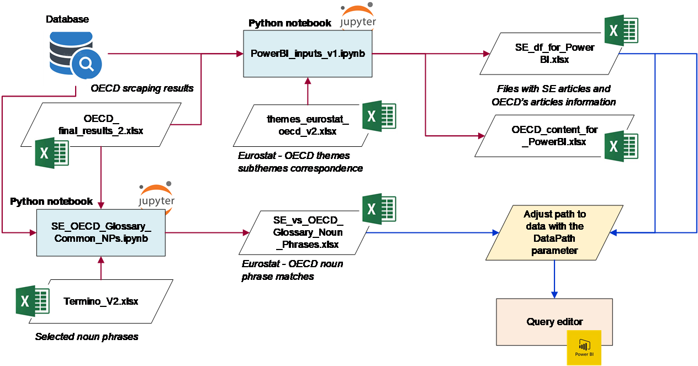
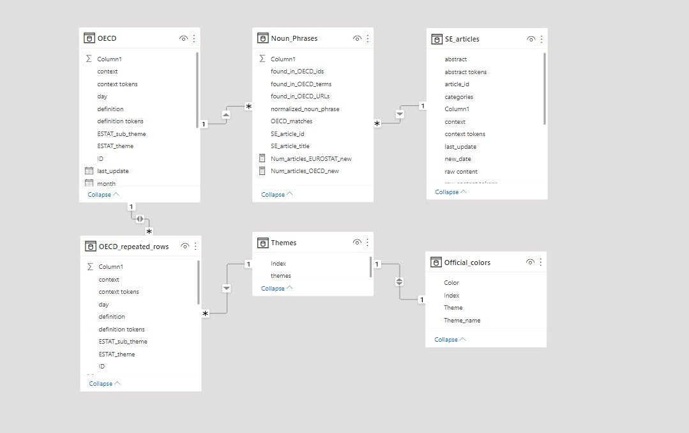
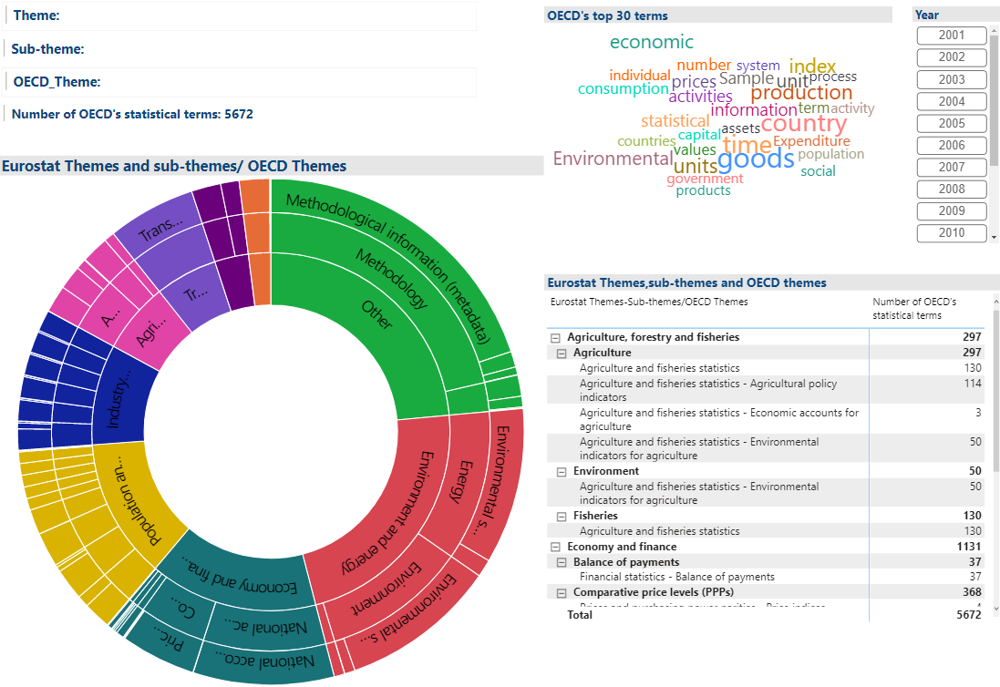
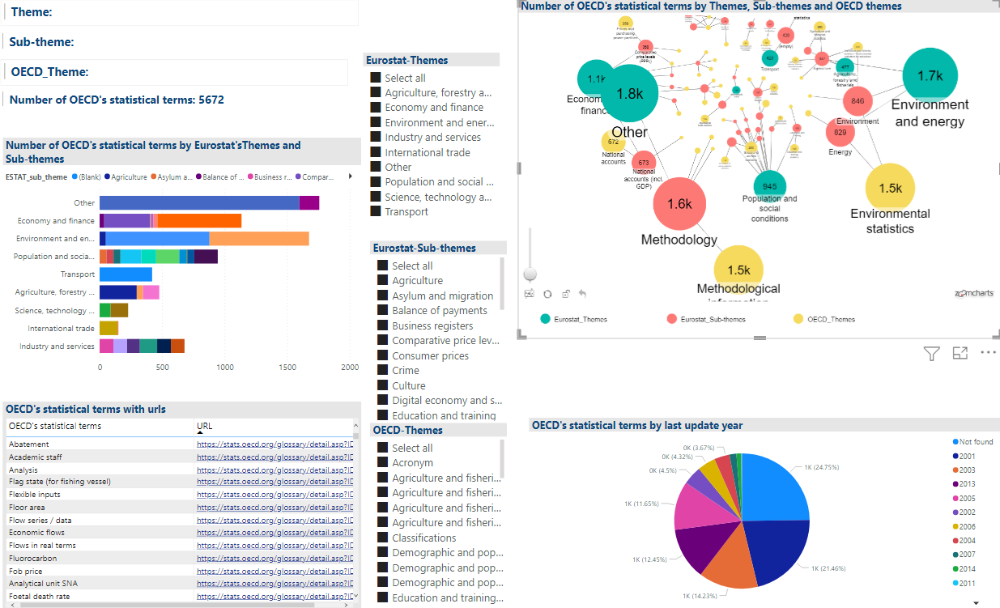
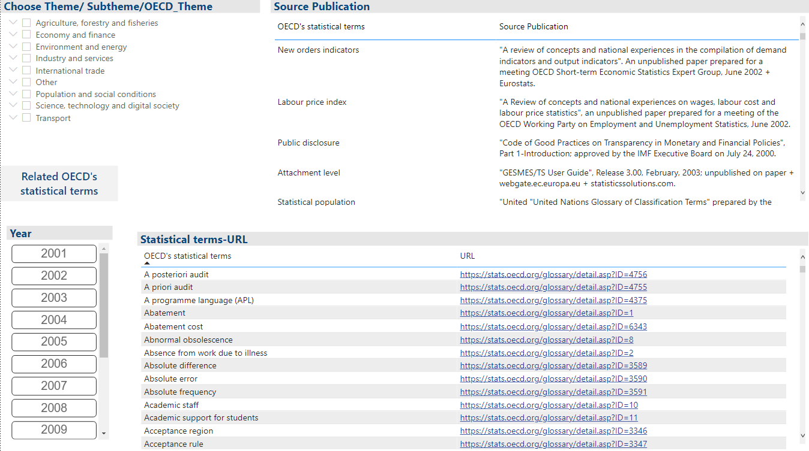
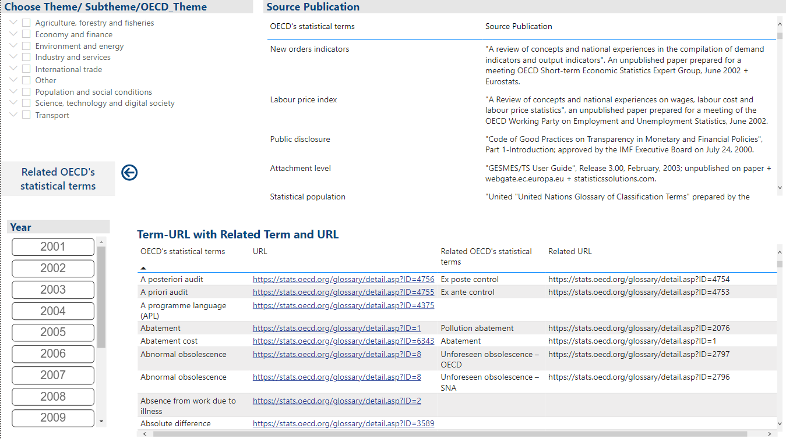
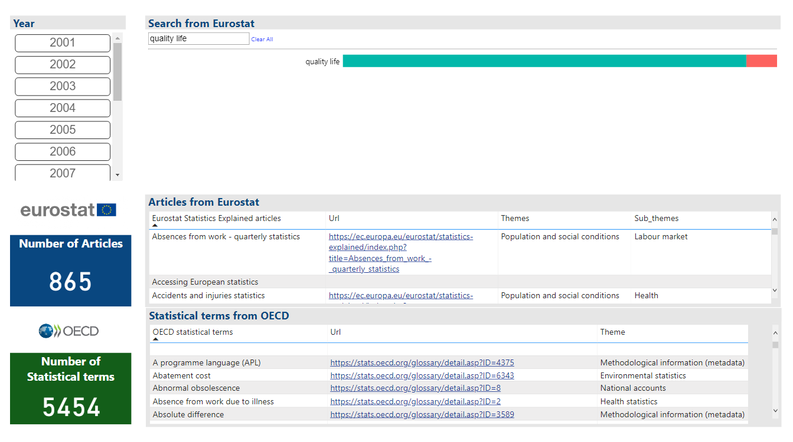
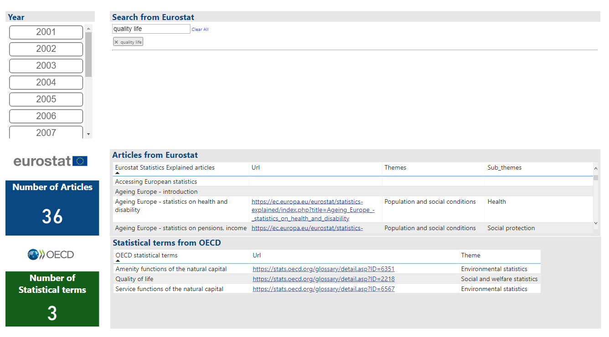

**To be updated:** The Jupyter notebook which produces the two files - inputs to Power BI has been revised. The new version [PowerBI_inputs_v1_rev_Jan2022.ipynb](PowerBI_inputs_v1_rev_Jan2022.ipynb) loads all data from the database and does not require the external files mentioned below.

### MS Power BI application

The MS Power BI application works with the free desktop version and is portable. It can also be published to MS Azure cloud, with any Office 365 license. To install the application, it suffices to load the .pbix file ([Use_Case_B_graphical_expl_v14.pbix](https://github.com/eurostat/NLP4Stat/blob/testing/Use%20case%20B/Power%20BI/Use_Case_B_graphical_expl_v14.pbix) from any folder, and define the path where the required files are located from the menu Transform data / Edit parameters. In the textbox, please put this path, ending with a backslash (\\). This parameter is called *DataPath*.

Figure 1 -- Setting the data path in the MS Power BI application.  

The required files and the codes producing them are shown in Figure 2 below. They are all included in the current folder.

-    The main data are in two Excel files: _OECD_content_for_PowerBI.xlsx_  and _SE_df_for_PowerBI.xlsx_. These are produced by the Python code _PowerBI_inputs_v1.ipynb_. 
-    This last notebook requires i) the same file with the scraped content from OECD's Glossary of Statistical Terms (_OECD_final_results_2.xlsx_) which is used in the Query Builder and the Faceted Search, and ii) file _themes_eurostat_oecd_v2.xlsx_, used also in the Faceted Search, which was created manually and contains, for each Eurostat theme and subtheme, the related OECD's themes. 
-    These data create the internal tables "OECD", "OECD_repeated rows" and "SE_articles" (see Figure 3). The first one comes from the original data while the second is created from the first by splitting themes, subthemes and OECD themes into unique values (in repeated rows). The third table contains data from the SE articles. 
-    Another input file is the Excel file _SE_vs_OECD_Glossary_Noun_Phrases.xlsx_  produced by the Jupyter notebook _SE_OECD_Glossary_Common_NPs.ipynb_ ([^1]). This notebook requires file _Termino V2.xlsx_  which has a manual filtering of the noun phrases found in the SE articles, keeping the most "useful" ones. The produced Excel file creates the table "Noun_Phrases" in Figure 3. 
-    Other tables and values shown in Figure 3 ("Themes", "Official_colors") are auxiliary.
  

Figure 2 -- Feeding of the MS Power BI application.

Figure 3 -- Tables and relationships in the MS Power BI application.

The application consists of four screens. The **first screen** ("Themes, sub-themes and OECD-Themes")(see Figure 4) contains a sunburst plot and a matrix visual with the Eurostat themes, the Eurostat subthemes and the OECD themes. In the sunburst plot, the inner ring has the Eurostat themes, the middle one has the Eurostat subthemes and the outer ring has the OECD themes. The sizes of the segments are proportional to the number of the corresponding OECD's statistical terms. The matrix visual has the same hierarchy. Selecting any of these segments in either visual, filters the other members in the hierarchy and also updates the word cloud at the top right part. 

The word cloud is based on words collected from the definitions of the OECD's statistical terms. There are also information cards at the top left part of the screen and a last update year filter to the right of the word cloud. There are also inverse interactions, i.e. the interactions with the word cloud are all 2-way. 

A weakness of the word cloud plot is the display of many common words. This is because the excluded words (other than some common stop-words) have to be entered manually. The alternative, of producing a word cloud with R via libraries tm and ggplot2 does not allow interaction through selection of words. 

Figure 4 -- Graphical exploration in MS Power BI: Page "Themes, sub-themes and OECD-Themes (1)".

The **second screen** ("Themes, sub-themes and OECD-Themes (2)") (see Figure 5) also links Eurostat themes and subthemes, OECD themes and OECD's statistical terms, with the same data as in the first screen. The filters in the middle of the screen allow the selection of any number of Eurostat themes / subthemes and OECD's themes and the network graph in the top right side is adjusted to reflect these selections. Conversely, one can click on a node in the network graph to select a Eurostat theme,Eurostat subtheme or OECD theme. Clicking the *same node* again clears the selection. 

In the bar chart to the left of the page, the user can select Eurostat subthemes within Eurostat themes and his/her selection interacts with the table below, which shows the corresponding OECD's statistical terms together with their URLs. There is also a pie chart at the bottom right of the page, showing the distribution into years of last update (again, allowing inverse interaction, i.e. further filtering by selected years).  

Figure 5 -- Graphical exploration in MS Power BI: Page "Themes, sub-themes and OECD-Themes (2)".

The **third screen** ("Themes, sub-themes and OECD-Themes (3)") (see Figure 6) also links Eurostat themes and subthemes, OECD themes and OECD's statistical terms, with the same data as in the first and second screens. It contains a selector with the Eurostat themes and subthemes and the OECD themes in the upper left part.There is a last update year filter too below this selector.The table at the bottom shows the OECD's statistical terms with their URLs and when the user clicks on a statistical term then the table above shows the source publication  for this statistical term (see Figure 6). When the user clicks the button **Related OECD's statistical terms** then the table changes and displays the related statistical terms along with their URLs (see Figure 7).Pressing the **Back** button returns to the previous view of the table with only the OECD's statistical terms with their URLs, i.e. as in Figure 6.

Figure 6 -- Graphical exploration in MS Power BI:  Page "Themes, sub-themes and OECD-Themes".

Figure 7 -- Graphical exploration in MS Power BI: Graphical exploration in MS Power BI: Page "Themes, sub-themes and OECD-Themes" after pressing the button "Related OECD's statistical terms".

The fourth screen ("Common_Noun_Phrases" - Figure 8) shows a search tool (attribute slicer) through which the user can search for noun phrases. The closest ones are displayed as options in the form of tags (the options are from the "OECD_matches" column in file _SE_vs_OECD_Glossary_Noun_Phrases.xlsx_). Next to the tags, there is a bar that shows how many Statistics Explained articles and OECD's statistical terms it has found (the turquoise color represents the Statistics Explained articles and the pink represents the OECD's statistical terms). Τhe user can select as many tags as he/she wants by clicking on them. **After the user clicks on some part of the bar, the corresponding noun phrase becomes active and is added to the query**.

Below the selection part, there are two tables, which display the results, based on the user's query.The first table shows the Statistics Explained articles with their URLs and the relevant Eurostat themes and sub-themes.The second table displays the corresponding OECD's results. For example, if the user enters the "quality life" noun phrase, then the "quality life" tag is added and the tables are changed automatically to reflect this choice. Figures 8 and 9 show these results before (initial results) and after clicking on the bar (filtered results).

Figure 8 -- Graphical exploration in MS Power BI: Page "Common_Noun_Phrases" – before clicking on the bar.

Figure 9 -- Graphical exploration in MS Power BI: Page "Common_Noun_Phrases" – after clicking on the bar.

A live version of the application can be found [here](https://app.powerbi.com/view?r=eyJrIjoiZDU0NDYwZmMtYTcxOC00NjM2LTgxZDQtN2FlNGEzNDk1YmRkIiwidCI6ImM1MmVlYWMzLWUwNzctNDMyYy04MWUzLTRiY2JhZjZiOTM1ZSIsImMiOjl9).

[^1]: See: https://github.com/eurostat/NLP4Stat/tree/testing
