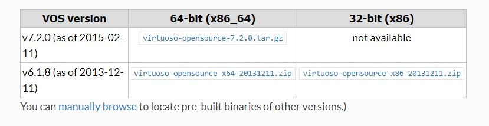

* Download a Virtuoso Open Source (VOS) for Windows distribution from [this link](http://vos.openlinksw.com/owiki/wiki/VOS/VOSBuild#Building%20for%20Windows):
. 

* Preferably version 7.2 for 64-bit machines which is available [here](https://sourceforge.net/projects/virtuoso/files/latest/download). The link in the table above seems to be broken. Run the installer as administrator and accept the defaults. The default installation is shown below:

. 

* With this default installation as example:
    *  Go to the **system** environment variables and add C:\Program Files\OpenLink Software\Virtuoso OpenSource 7.2\bin and C:\Program Files\OpenLink Software\Virtuoso OpenSource 7.2\lib to the system PATH variable.
    *  Crete a new **system** variable VIRTUOSO_HOME with value C:\Program Files\OpenLink Software\Virtuoso OpenSource 7.2\

* Open the ODBC Data Sources (64-bit) tool in control panel, go to Tab System DSN and create a new data source selecting the Virtuoso (Open Source) driver:

. 
 
* Fill the first configuration screen as follows. Do NOT put http:// or https:// in front of the server address.

. 

. 

